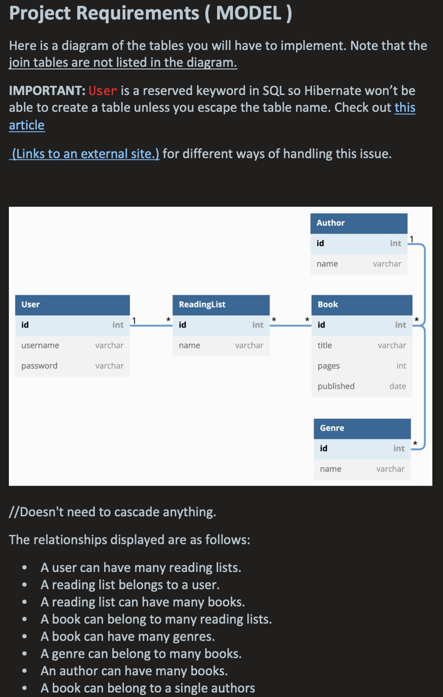

# Flat-Ass-3_0.00

[Notes](https://onedrive.live.com/view.aspx?resid=CE644F343B738546%2118913&id=documents&wd=target%28Lecture%2FWeek%208.one%7C975FB69D-9448-2242-B7BC-142A080759BD%2FProject%7C9512525A-0349-E84D-B9EB-28E9F598F148%2F%29
onenote:https://d.docs.live.net/ce644f343b738546/Documents/Flatiron%20x%20BlackRock/Lecture/Week%208.one#Project&section-id={975FB69D-9448-2242-B7BC-142A080759BD}&page-id={9512525A-0349-E84D-B9EB-28E9F598F148}&end)

POSTMAN config in root directory: "Assesment.postman_collection.json"